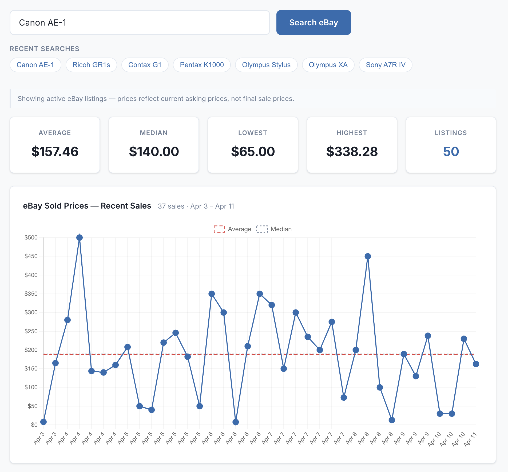

# ShutterWatch

A used camera price tracker with AI market analysis. Search eBay for active camera listings, get Claude-powered market summaries, and set price alerts that fire Discord notifications.

## Screenshot



---

## Features

- **eBay Search** — query active listings filtered to the camera category (ID 625)
- **Price Statistics** — average, median, low, high, and listing count
- **AI Market Summary** — Claude analyzes listings and writes a 3-4 sentence market assessment
- **Price Alerts** — save a camera model + threshold; ShutterWatch checks eBay every 24 hours and pings Discord when a match is found
- **LLM Condition Filter** — optional AI assessment to flag broken/parts-only listings and exclude them from price averages

---

## Local Setup

### 1. Clone the repo

```bash
git clone <your-repo-url>
cd shutterwatch
```

### 2. Create a virtual environment

```bash
python -m venv venv
source venv/bin/activate    # macOS/Linux
# venv\Scripts\activate     # Windows
```

### 3. Install dependencies

```bash
pip install -r requirements.txt
```

### 4. Configure environment variables

```bash
cp .env.example .env
```

Open `.env` and fill in your credentials (see table below).

### 5. Run the development server

```bash
flask run
```

Open [http://localhost:5000](http://localhost:5000) in your browser.

---

## Environment Variables

| Variable | Required | Description |
|----------|----------|-------------|
| `EBAY_CLIENT_ID` | Yes | eBay application Client ID (from [developer.ebay.com](https://developer.ebay.com/)) |
| `EBAY_CLIENT_SECRET` | Yes | eBay application Client Secret |
| `ANTHROPIC_API_KEY` | Yes | Anthropic API key (from [console.anthropic.com](https://console.anthropic.com/)) |
| `DISCORD_WEBHOOK_URL` | No | Discord webhook URL for price alert notifications |

### Getting eBay API credentials

1. Sign up at [developer.ebay.com](https://developer.ebay.com/)
2. Create a new application
3. Under **Application Keys**, copy the **App ID (Client ID)** and **Dev ID (Client Secret)** from the **Production** keyset
4. The app uses the Browse API with the public `https://api.ebay.com/oauth/api_scope` scope — no user auth required

### Getting an Anthropic API key

1. Sign up at [console.anthropic.com](https://console.anthropic.com/)
2. Generate an API key under **API Keys**

### Creating a Discord webhook

1. Open your Discord server settings
2. Go to **Integrations > Webhooks > New Webhook**
3. Name it "ShutterWatch", select a channel, and copy the webhook URL

---

## Project Structure

```
shutterwatch/
├── app.py               # Flask app factory + API routes
├── config.py            # Environment variable loading + constants
├── models.py            # SQLAlchemy models (Search, Listing, Alert)
├── ebay_client.py       # eBay Browse API OAuth2 + search logic
├── claude_client.py     # Anthropic Claude API (market summary + condition filter)
├── scheduler.py         # APScheduler 24-hour saved search job
├── discord_client.py    # Discord webhook notifications
├── templates/
│   └── index.html       # Single-page app frontend
├── static/
│   └── style.css        # Stylesheet
├── requirements.txt
├── render.yaml          # Render deployment configuration
└── .env.example         # Environment variable template
```

---

## Tech Stack

- **Backend:** Python, Flask, SQLAlchemy, SQLite
- **AI:** Anthropic Claude (`claude-sonnet-4-20250514`)
- **Pricing Data:** eBay Browse API
- **Notifications:** Discord webhooks
- **Scheduling:** APScheduler (background thread, 24h interval)
- **Deployment:** Render, Gunicorn (single worker)
